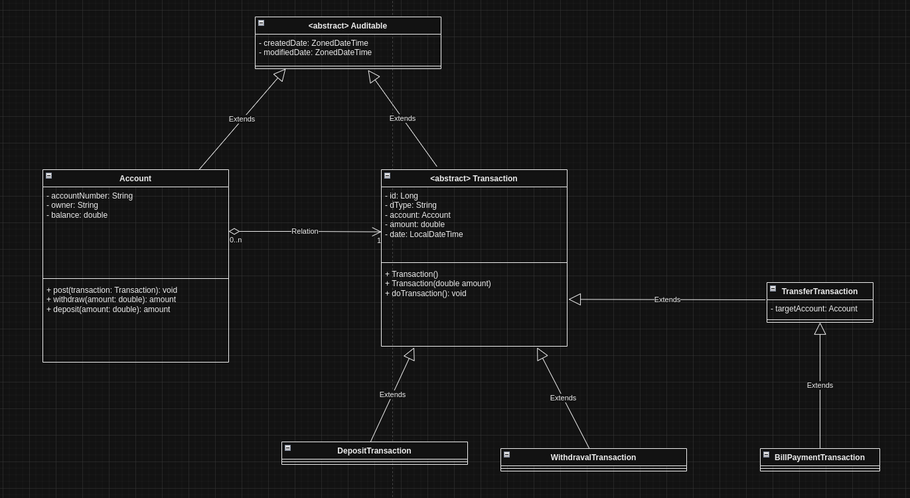
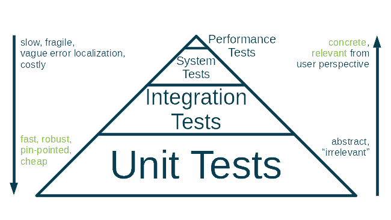

# Getting Started with Simple Banking

In this assignment, I built simple banking from the repository given by Eteration. I have completed Task 1 and Task2, and also completed Bonus for Task 1. I also have added extra endpoints for inserting a new account and transfer money between two accounts.

To not being have to update Account's post(Transaction transaction) implementation for each Transaction type, I decided to put the transaction executing logic into Transaction and overrided for each required subclass. So that, only executing the transaction's doTransaction() method is enough to execute the transaction. This approach is more maintainable and reusable than the overriding post() method of Account again and again. 

To not being have to write getters, setters ans constructors for each entity, I used Lombok library.

I used PostgreSQL database for persisting data.

## About AccountController
To keep the given unit tests happy, I did not change the some methods of AccountController such as credit(), debit(). So that, I added some business logic to AccountController, which should not be in the controller class because of the Single Responsibility principle. They need to be put into AccountService class, which business logic implementation should be in. Additionally, I added two new endpoints for creating account and transfering money between two accounts and put all the business logic into AccountService to show how I would design and implement such a case.
 
## Tests
I provided integration tests for all the endpoints in AccountController. I covered possible scenarios for each endpoint. So that, I ensured controller functions correctly and integrates with service correctly by validating the response status and body. I also did a little bit of extra and used Repository to fetch de newly inserted row from the database to validate the data is inserted correctly. This approach not only verifies the correctness of the controller's behavior but also provides confidence in the integrity of the underlying data layer. 

## Swagger
I also added Swagger to the project to document the API. You can access the Swagger UI by navigating to http://localhost:8080/swagger-ui.html

## About Account Id Scheme
By examining the given unit tests, I realized that the account id is generated by the following pattern: 669-7788. So that, I decided to use the same pattern for the account id. In this task's case, I put the accountNumber into the POST request's body field and checked if it exists. I would prefer to use the account id as a path variable in the URL and also generate them automatically with UUID, but I did not change to make given unit tests happy.  